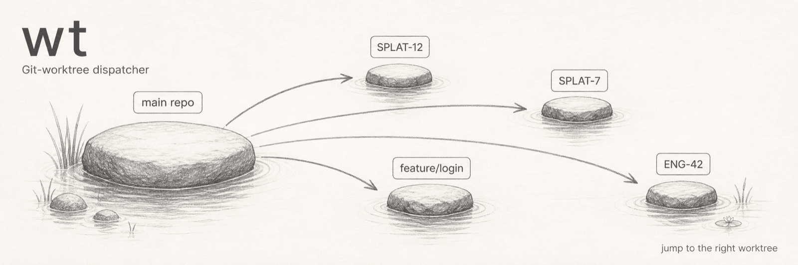

# wt

Git-worktree dispatcher. Resolves a ticket id (e.g. `SPLAT-12`) or branch
substring to a worktree of the current git repository and runs commands
defined in `.wt.yaml` there. Tracks detached processes.

```
$ wt -d 12
$ wt -d 7
$ wt status
REPO/LABEL      TARGET  PID    UPTIME    WORKTREE
myapp/SPLAT-12  server  34567  00:01:42  ../myapp-splat-12
myapp/SPLAT-7   server  33445  00:14:08  ../myapp-splat-7
$ wt stop 7
```

## vs. asking an AI agent

An agent can also run commands in the right worktree, but each invocation
costs tokens and a few seconds of round-trip. `wt 12` is a plain command:
no LLM call, no latency.

## Setup

```bash
pip install git+https://github.com/mutexre/worktree-runner.git
```

Or clone and install editable for development:

```bash
git clone https://github.com/mutexre/worktree-runner.git
pip install -e ./worktree-runner
```

In each project:

```bash
cd <repo-root> && wt init
```

`wt init` prompts for common targets and writes `.wt.yaml`. An agent skill
that scaffolds the same config from project structure is bundled — install
it once with:

```bash
wt install-skill                 # default: ~/.cursor/skills/init-wt
wt install-skill --target <path> # other agent skill directories
```

Then, in any repo, ask your agent to "init wt for this project".

Requirements: Python 3.10+, git >= 2.5.

## Config (`.wt.yaml`)

```yaml
targets:
  run: python run.py
  test: pytest
  install: pip install -e .[dev]
```

For projects with multiple long-running services, group them:

```yaml
targets:
  server: python manage.py runserver
  worker: celery -A myapp worker
  frontend: npm run dev

groups:
  run: [server, frontend]
  full: [server, worker, frontend]
```

`wt -d 12` starts every target in the `run` group as a separately tracked
process. `wt stop 12` terminates all of them. If no `.wt.yaml` exists, `wt`
falls back to `make <target>`.

Each target is launched in its own process group, so any subprocesses it
spawns (build watchers, hot-reload workers, npm-spawned children, etc.) are
tracked together: `wt status` reports the group as alive while any
descendant is running, and `wt stop` SIGTERMs the entire group. The only
escape is a process that explicitly calls `setsid()` to detach itself
(rare for dev tooling).

## Commands

```
wt                       list worktrees
wt init                  create .wt.yaml (interactive)
wt add <ticket-or-branch>  fetch remote branch + create local worktree
wt <ticket>              run default target in foreground
wt -d <ticket>           run detached (supports groups)
wt -d <ticket> --force   replace running detached
wt -t <target> <ticket>  run a specific target
wt stop <ticket>         stop detached (SIGTERM, SIGKILL after 5s)
wt stop --all            stop everything, all repos
wt status                show all detached apps, all repos
wt logs <ticket>         tail -f the detached log
wt path <ticket>         print absolute worktree path
wt tree <ticket>         print process tree of running group (PGID-scoped)
```

## Adding a worktree from a remote branch

Cloud agents (Cursor Cloud Agent, Devin, GitHub Copilot Workspace, etc.)
commit their work to remote branches you may not have locally yet. `wt add`
bridges the gap with a single command:

```bash
wt add WR-12          # ticket id → resolves against remote branches
wt add cursor/foo     # exact remote branch name
wt add origin/foo     # remote prefix is stripped automatically
wt add WR-12 --path /path/to/dir  # custom worktree directory
```

What it does:

1. `git fetch origin` to pull down the latest remote refs
2. Resolves the argument against remote branches using the same ticket-style
   logic as local resolution (prefix inference, fuzzy match)
3. `git worktree add --track -b <branch> <path> origin/<branch>` so
   `git pull` / `git push` work without `--set-upstream`
4. Prints the worktree path; subsequent `wt <ticket>` resolves normally

**Worktree path naming** defaults to `../<repo-name>-<branch-slug>` where
the slug lowercases the branch name and replaces non-alphanumeric characters
with `-`. Override with `--path`.

**Stale local branch**: if a local branch with the same name already exists,
`wt add` exits with an error rather than overwriting it. Delete the branch
manually (`git branch -D <branch>`) and retry.

**Idempotent**: re-running `wt add WR-12` when the worktree already exists
at the same path is a no-op and prints the path.

**Auth prompts**: `wt add` runs `git fetch` which may prompt for SSH
passphrase or other credentials. The terminal is connected to git's stdin/tty
so prompts flow through normally.

### Crash detection

`wt` detects crashed detached processes on every invocation. When a process
dies unexpectedly (i.e. without a preceding `wt stop`), the next `wt` command
records the crash in the state file. `wt status` then shows an extra section:

```
EXITED SINCE LAST CHECK:
  myapp/SPLAT-12 / server   exit ?   4m ago
    ──── last 10 log lines ────
    [vite] error: Cannot find module 'react'
    ...
```

Exit entries are **cleared after the first `wt status` display** (acknowledged
on read). Clean shutdowns via `wt stop` are never shown — only unexpected
exits appear here.

**Exit code shown as `exit ?`**: because detached processes run in their own
session (`start_new_session=True`), `wt` is not their parent and cannot
retrieve the exit code via `waitpid`. The exit code is stored as `null` in the
state file. A push-based watcher (WR-19) would resolve this by observing the
process at launch time.

## Resolution

`wt` resolves the argument against three things, in this order:

1. **Exact match** on ticket, full branch name, or worktree directory name
2. **Fuzzy substring** on the same three fields

Ticket detection is configurable. By default `wt` matches case-insensitive
`prefix-N` tokens (covers Jira `SPLAT-12` and Linear `eng-42`) and infers
the prefix from existing branches.

- `wt SPLAT-12` — exact ticket
- `wt 12` — expands to `SPLAT-12` using the inferred prefix
- `wt feature/login` — exact branch name (works even if no ticket scheme
  applies to this repo)
- `wt login` — fuzzy substring against ticket, branch, or directory name

Override the matcher in `.wt.yaml`:

```yaml
ticket_style: jira         # strict uppercase: SPLAT-12
ticket_style: linear       # case-insensitive prefix-N (default)
ticket_style: github       # numeric IDs: 123-fix-bug -> #123
ticket_style: 'TASK_(\d+)' # any regex; 1 group = full token, 2 groups = prefix-N
```

## Working with docs assets

PNG images under `docs/` must stay below 500 KB. After adding or replacing
an image, run:

```bash
./scripts/optimise-images.sh
```

CI will fail the build if any `docs/*.png` exceeds the budget.

## License

MIT.
